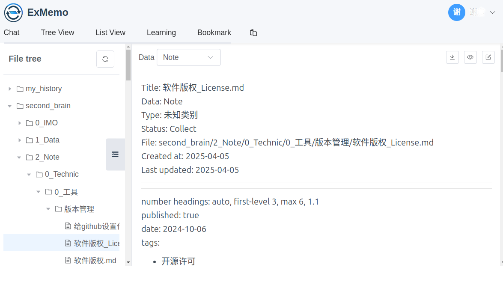

English | [中文简体](./README_cn.md)

# ExMemo

> Total Control Over My Data 🚀

## 1 Introduction

### 1.1 Features


ExMemo is a personal knowledge management tool designed to record and manage various types of information, such as favorite texts, web pages, work documents, images, music, videos, and personal reflections. It can also store specific details like item locations, phone numbers, and addresses. By leveraging automated categorization and naming, ExMemo organizes information systematically, helping users broaden their thinking and uncover hidden connections.


The system consists of a database, backend, and multiple frontend components. Distributed storage and databases store user files, texts, and vector data, with support for local deployment to ensure privacy. The backend provides APIs for CRUD operations, handles large model interactions, and processes data. It supports online models like OpenAI, Deepseek, and Qwen, as well as offline models like Ollama. Frontend options include a web service, a WeChat bot, an Obsidian plugin, and a browser extension, allowing users to upload and download data conveniently.

ExMemo also integrates practical tools like calorie calculators, translators, reading aids for academic papers, and English learning helpers, demonstrating the synergy of personal data with large models and tools. Developers can use the backend service to create personalized applications based on user data.

*Data Manager*



*Chat Interface*


*View Notes*


*Bookmark Manager*


### 1.2 Video Tutorials

* [View and Edit Content](https://www.bilibili.com/video/BV1mAQgYVE2S/)

## 2 Installation

The system employs modular management using PgVector databases and languages like Python, JavaScript (VUE3), and TypeScript. It is containerized with multiple Docker images to suit different environments. Users can start required modules via `docker-compose`.

### 2.1 Configuration

Download the source code and assume all project-related data is stored in the `/exports/exmemo` directory.

``` shell
export EXMEMO_DIR=/exports/exmemo
mkdir -p $EXMEMO_DIR/code $EXMEMO_DIR/data
cd $EXMEMO_DIR/code
git clone https://github.com/exmemo-ai/exmemo.git
cd exmemo
```

Set personal environment variables based on the format of env_default.

``` shell
cp backend/env_default backend/.env
vi backend/.env
```

At minimum, configure the following: IP addresses, LANGUAGE_CODE, and PGSQL_PASSWORD.

**Recommended backend model configuration:**

* If OpenAI is accessible, set DEFAULT_CHAT_MODEL to gpt-4o and DEFAULT_TOOL_MODEL to gpt-4o-mini.
* If OpenAI is not accessible (e.g., in China), set DEFAULT_CHAT_* and DEFAULT_TOOL_* to deepseek.

### 2.2 Start Services

#### 2.2.1 Start in Production Mode

```shell
docker-compose --env-file backend/.env --profile production up -d
```

Refer to shell/prod.sh for detailed commands.

Once completed, you can use ExMemo's core features. Access the frontend at http://ip:8084/ and register an account to get started.

### 2.3 Upgrades

During upgrades, rebuild Docker images, restart Docker Compose, and remove old containers to avoid issues. Follow the steps in shell/update.sh.

### 2.4 Notes

* Always update the frontend, backend, plugins, and .env configuration files together to avoid compatibility issues caused by API changes.
* Building images consumes significant memory. Release resources if running on a limited cloud server.
* The database password in docker-compose is only applied during database creation. Update .env and modify the database password using SQL statements if needed.

## 3 Additional Configuration

*These configurations are optional and do not affect core functionalities.*

### 3.1 Obsidian Plugin

Install the third-party plugin obsidian-exmemo-client from the Obsidian community. Configure the backend address in the settings to enable note management and synchronization across devices.

Plugin source code: https://github.com/exmemo-ai/obsidian-exmemo-client

### 3.2 Browser Plugin

browser-exmemo-bmsync is a Chrome extension that synchronizes browser bookmarks with ExMemo. Usage guide: https://github.com/exmemo-ai/browser-exmemo-bmsync

### 3.3 WeChat Plugin

Integrate the open-source project chatgpt-on-wechat (COW) to use ExMemo via WeChat, Feishu, or DingTalk. ExMemo acts as a plugin for COW, with source code located in ui/wechat/. Installation steps:

First, download the chatgpt-on-wechat project:

``` shell
cd $EXMEMO_DIR/code
git clone https://github.com/zhayujie/chatgpt-on-wechat
```

Install the plugin:

```shell
cd $EXMEMO_DIR/code/exmemo/ui/wechat
. install.sh # Copy the plugin to the WeChat tool
```

Start the WeChat image:

```shell
cd $EXMEMO_DIR/code/exmemo/
docker-compose --env-file backend/.env --profile production up -d ewechat
```

Check logs:

```shell
$ docker logs ewechat
```

For debugging, ensure the ExMemo plugin initializes correctly. If it fails, verify that ExMemo is set to true in chatgpt-on-wechat/plugins/plugins.json.

### 3.4 Start in Development Mode

For backend/frontend code modification and debugging, start in development mode and run the backend Python program manually.

```shell
docker-compose --env-file backend/.env --profile development up -d
docker exec -it ebackend_dev bash
> cd backend
> python manage.py runserver 0.0.0.0:8005
```

Refer to shell/dev.sh and shell/run.sh for more details.

### 3.5 S3 Storage: Minio

By default, data is stored in the host directory. To use Minio S3 storage, configure Minio options in .env. Minio does not start automatically. To enable Minio on the host, start the service manually:

```shell
docker-compose -f docker-compose-dev.yml up -d minio
```

## 4 Changelog

View the full changelog: [CHANGELOG](./CHANGELOG.md)

## 5 License

This project is licensed under the GNU Lesser General Public License v3.0. For details, see the [LICENSE](./LICENSE) file.

## 5 Contributors

<a href="https://github.com/Exmemo/exmemo/graphs/contributors" target="_blank">
  
</a>
