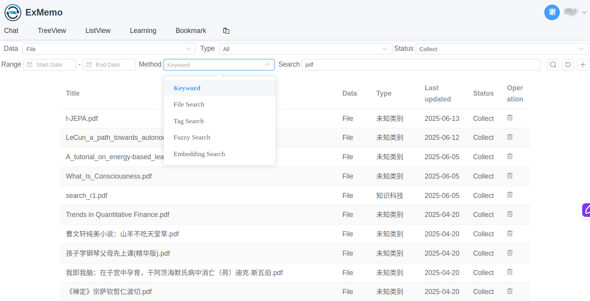

# ExMemo

> 我的数据我做主 🚀

## 1 介绍

### 1.1 功能


ExMemo 是一款个人知识管理工具，专注于集中记录和管理多种信息类型，如喜爱的文字、网页、工作文档、图片、音乐、视频，以及生活感悟与思考。它还能记录物品位置、电话号码和地址等具体信息。ExMemo 通过自动分类和命名，实现信息的系统化整合，帮助用户拓宽思维边界，发现内在关联。


系统包括数据库、后端和多个前端组件。分布式存储和数据库用于保存用户文件、文本及其向量数据，并支持本地部署以保护用户隐私。后端提供通用接口进行数据的增删改查，负责调用大模型和处理数据。系统兼容 OpenAI、Deepseek、Qwen 等在线大模型，以及 Ollama 离线模型。多个前端以 Web 服务、微信机器人、Obsidian 插件和浏览器插件等形式，便于用户上传和下载数据。

我们在 ExMemo 框架上增添了多种实用工具，包括热量计算、翻译、论文辅助阅读和英语学习。这些工具展示了个人数据结合大模型与工具后的效果。此外，系统还提供树型文件列表和预览功能，支持批量任务处理，以及增强的文本编辑能力（包括图片上传、编辑和OCR识别）。用户可以导入和解压ZIP文件，并将各种文本格式转换为markdown。其他开发者也可以利用后端服务，开发基于数据的个性化应用。

*数据管理*




*聊天界面*


*查看笔记*


*书签管理*


### 1.2 视频介绍

* [查看和编辑内容](https://www.bilibili.com/video/BV18ZQuY2ETP/)
* [学习工具](https://www.bilibili.com/video/BV1hhQ6YvE4m/)

## 2 安装

系统采用模块化管理，通过 PgVector 数据库以及 Python、JavaScript（VUE3）和 TypeScript 等语言实现。为适应不同环境，系统拆分为多个 Docker 镜像。用户通过操作 docker compose 即可启动所需模块。

### 2.1 配置

下载源码，并假设用户的所有项目相关数据都存储在 /exports/exmemo 目录中。

``` shell
export EXMEMO_DIR=/exports/exmemo
mkdir -p $EXMEMO_DIR/code $EXMEMO_DIR/data
cd $EXMEMO_DIR/code
git clone https://github.com/exmemo-ai/exmemo.git
cd exmemo
```

根据 env_default 的格式来设置用户的个人环境变量。

``` shell
cp backend/env_default backend/.env
vi backend/.env
```

至少需要设置以下参数：各个 IP 地址、LANGUAGE_CODE 和 PGSQL_PASSWORD。

**建议使用 OpenAI 作为后端模型：**  

* 如果可连接 OpenAI，建议将 DEFAULT_CHAT_MODEL 设为 gpt-4o，DEFAULT_TOOL_MODEL 设为 gpt-4o-mini。
* 如果无法连接 OpenAI（如在中国地区），则建议将 DEFAULT_CHAT_* 和 DEFAULT_TOOL_* 设置为 deepseek。

### 2.2 启动服务

#### 2.2.1 以生产模式启动

```shell
docker compose --profile production up -d
```

请查看 shell/prod.sh 获取具体命令。

按照上述步骤完成后，即可使用 ExMemo 的基本功能。打开 http://ip:8084/ 可以访问前端界面，使用前请先注册用户账号。

#### 2.2.2 本地构建镜像（可选）

如果需要本地构建镜像而不是使用 Docker Hub 的预构建镜像：

```shell
# 构建后端镜像
cd backend
docker build -t xieyan800811/ebackend:latest . --build-arg HTTP_PROXY=$HTTP_PROXY --build-arg HTTPS_PROXY=$HTTP_PROXY

# 构建前端镜像
cd ../ui/web_frontend
docker build -t xieyan800811/efrontend:latest . --build-arg HTTP_PROXY=$HTTP_PROXY --build-arg HTTPS_PROXY=$HTTP_PROXY
```

### 2.3 升级

在项目升级时，为避免出现意外问题，需要重新打包 Docker 镜像，重新运行 Docker Compose，并删除旧容器。具体操作请参考 shell/update.sh。

### 2.4 注意

* 请同时升级前端、后端、插件和配置文件.env，否则可能因接口升级导致部分功能失效。
* 打包时内存占用较大，当云服务器资源有限时，建议优先释放一些资源。
* Docker-compose 中设置的数据库密码仅在创建数据库时生效，若需修改，需在.env 文件中更新，并连接数据库使用 SQL 语句进行更改。

## 3 其它配置

*以下配置均为可选项，不影响核心功能。*

### 3.1 Obsidian 插件

您可以在 Obsidian 社区安装第三方插件 obsidian-exmemo-client。只需在设置中输入 ExMemo 的后端地址，即可实现 Obsidian 笔记的管理与笔记多设备同步。

插件源码可在此查看: https://github.com/exmemo-ai/obsidian-exmemo-client

### 3.2 浏览器插件

browser-exmemo-bmsync 是一款基于 ExMemo 的 Chrome 插件，可将浏览器书签同步到 ExMemo。使用说明详见: https://github.com/exmemo-ai/browser-exmemo-bmsync

### 3.3 微信插件

您可以通过集成开源项目 chatgpt-on-wechat（COW），在微信、飞书、钉钉中使用 ExMemo。ExMemo 作为 COW 的插件，其源码位于本项目目录中的 ui/wechat/。安装步骤如下：

首先，下载 chatgpt-on-wechat 项目：

``` shell
cd $EXMEMO_DIR/code
git clone https://github.com/zhayujie/chatgpt-on-wechat
```

安装插件：

``` shell
cd $EXMEMO_DIR/code/exmemo/ui/wechat
. install.sh # 复制插件到微信工具中
```

启动 wechat 镜像：

``` shell
cd $EXMEMO_DIR/code/exmemo/
docker compose --profile production up -d ewechat
```

查看 log 信息：

```shell
$ docker logs ewechat
```

调试方法：运行程序时，确认 ExMemo 插件是否正常加载和初始化。如果无法正常初始化，请确认在 chatgpt-on-wechat/plugins/plugins.json 文件中，ExMemo 是否设置为 true。

### 3.4 以开发模式启动

如果需要修改和调试前后端代码，请以开发模式启动，并手动运行后端 Python 程序。

```shell
docker compose --profile development up -d
docker exec -it ebackend_dev bash
> cd backend
> ./shell/run.sh
```

具体方法请参见 shell/dev.sh, backend/shell/run.sh。

### 3.5 S3 存储：minio

数据默认存储于宿主机目录。若需使用 Minio S3 存储，请在.env 文件中配置 MINIO 相关选项。Minio Docker 不会自动启动，如需在宿主机上启用 Minio 服务，请手动操作。

```shell
docker compose -f docker-compose.yml up -d eminio
```

## 4 更新日志

查看完整更新历史：[CHANGELOG](./CHANGELOG_cn.md)

## 5 License

本项目根据 GNU Lesser General Public License v3.0 授权。详情请参阅 [LICENSE](./LICENSE) 文件。